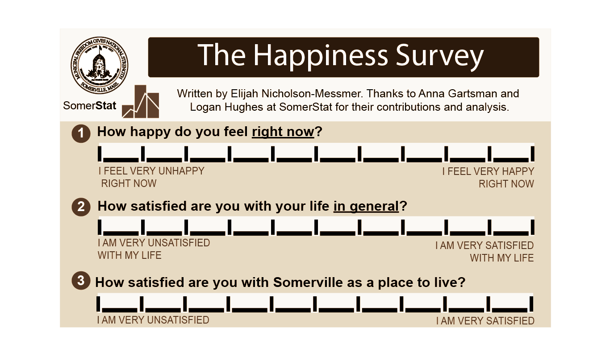

# The Happiness Survey

This project was created as a final project in Visualization Technologies I at Northeastern University as part of the Media Innovation and Data Communication Master's program. The project was created by Elijah Nicholson-Messmer. Working with analysts at SomerStat, the city of Somerville's in-house data collection and analysis department, the project illustrates how the city's happiness survey allows insights into the factors that most influence happiness and how the city is using the data to make more informed policy decisions. The project was created using the following tools:

* [RoughViz.js](https://github.com/jwilber/roughViz)
* [AI2HTML](http://ai2html.org/)
* [Adobe Illustrator](https://www.adobe.com/products/illustrator.html)
* [D3.js](https://d3js.org/)
* [Scrollama](https://github.com/russellsamora/scrollama)
* [Bootstrap](http://getbootstrap.com/)

Special thanks to Professor Alexandros Haridis for his guidance and support throughout the project. Read my longer write-up of the project [here](media/Visualization-Technologies-Final-Project-Writeup.pdf).
